# Battery Temperature Prediction

This project focuses on predicting the temperature of an LG 18650HG2 battery cell based on various parameters like voltage, current, and cycle information. The goal is to develop a reliable temperature prediction model that aids battery management systems by anticipating overheating risks and enhancing battery performance.

## Project Overview

Battery temperature plays a critical role in the safety and efficiency of lithium-ion cells. This project employs advanced modeling techniques to predict temperature using time-series data, with unique features engineered to capture cycle-specific behaviors, accumulated energy, and thermal changes.

## Data Description

### Original Data Source
The dataset used in this project originates from research conducted at McMaster University, Ontario, Canada, and is publicly available on Mendeley Data ([link](https://data.mendeley.com/datasets/cp3473x7xv/2)). This data was collected by Dr. Phillip Kollmeyer and colleagues as part of their work on State-of-Charge (SOC) estimation for lithium-ion batteries using a deep feedforward neural network (FNN) approach.

**Original Data Citation**:
- Philip Kollmeyer, Carlos Vidal, Mina Naguib, Michael Skells. *LG 18650HG2 Li-ion Battery Data and Example Deep Neural Network xEV SOC Estimator Script*. Published: March 6, 2020. DOI: [10.17632/cp3473x7xv.3](https://doi.org/10.17632/cp3473x7xv.3)

The data was collected using an LG 18650HG2 battery cell, tested in a thermal chamber and analyzed with a Digatron Universal Battery Tester.

### Summary Statistics of Data

Below is a summary of the main variables in the dataset, including key statistical indicators (mean, standard deviation, min, max, and quartiles):

| Statistic      | Step         | Voltage [V] | Current [A] | Temperature [C] | Capacity [Ah] | WhAccu [Wh] |
|----------------|--------------|-------------|-------------|-----------------|---------------|-------------|
| **Count**      | 5,423,272    | 5,423,272   | 5,423,272   | 5,423,272       | 5,423,272     | 5,423,272   |
| **Mean**       | 351.87       | 3.912       | 8.52e-3     | 8.35            | 0.1139        | 0.5481      |
| **Std**        | 799.02       | 0.3629      | 1.0469      | 16.6851         | 1.3026        | 4.9892      |
| **Min**        | 1            | 2.262       | -1.8001     | -22.5039        | -2.7807       | -10.3028    |
| **25%**        | 9            | 3.665       | -0.0407     | -9.6814         | -0.5800       | -2.1959     |
| **50%**        | 24           | 4.151       | 0.0         | 9.1625          | 0.0105        | 0.0457      |
| **75%**        | 44           | 4.187       | 0.0         | 23.8307         | 0.9399        | 3.6855      |
| **Max**        | 6,667        | 4.202       | 5.9993      | 41.3273         | 2.8180        | 10.9525     |

### Observations and Analysis

1. **Voltage**:
   - The voltage has a mean of around 3.91 V, which is typical for an LG 18650 battery under operation.
   - The minimum voltage recorded is 2.26 V, likely representing near-discharged conditions, while the maximum of 4.20 V aligns with a fully charged state.
   - Standard deviation is low, indicating voltage remains relatively stable during most of the cycle.

2. **Current**:
   - The mean current is near zero (0.0085 A), which suggests the dataset contains balanced charge and discharge cycles.
   - A wide range of current values, from -1.80 A (indicating discharge) to 5.99 A (indicating charge), shows various testing conditions. Negative values denote discharge events.
   - The relatively higher standard deviation of 1.05 A signifies that current changes frequently, possibly due to dynamic drive cycles or charge/discharge tests.

3. **Temperature**:
   - Temperature has a broad range from -22.50 °C to 41.32 °C, indicating testing under various ambient conditions.
   - The mean temperature (8.35 °C) and high standard deviation (16.68 °C) suggest temperature fluctuations due to different test conditions, including extreme high and low-temperature tests.
   - The presence of very low temperatures (below freezing) could imply cold weather performance tests.

4. **Capacity (Ah)**:
   - The mean capacity is 0.1139 Ah, which might reflect intermittent data capture across charge and discharge cycles.
   - A negative minimum value for capacity (-2.78 Ah) is unusual, possibly due to data handling or measurement anomalies that will need addressing.
   - The maximum capacity (2.81 Ah) aligns with the expected capacity of a fully charged 3Ah LG 18650 cell, suggesting full discharge cycles were included.

5. **Accumulated Energy (WhAccu)**:
   - The mean accumulated energy is 0.548 Wh, with a range spanning -10.30 Wh to 10.95 Wh.
   - Negative values might correspond to discharge cycles, where energy is drawn from the battery.
   - The range and standard deviation indicate varied usage scenarios, which could enhance the robustness of a predictive model by covering multiple operational conditions.

### Insights for Modeling
- The broad ranges and fluctuations in temperature, current, and capacity are beneficial for developing a robust temperature prediction model as they cover a wide range of realistic battery conditions.
- Handling negative values in capacity and accumulated energy may require preprocessing, as these could be anomalies or represent specific states in the cycle.
- Since the data includes both high and low temperatures, it may be useful to segment or engineer features for extreme conditions to improve model performance.

## Exploratory Data Analysis (EDA)

### Temperature Over Time
The temperature plot shows notable changes and fluctuations over time:
- **Early Stability**: Initially, the temperature is stable, indicating a relatively constant operating condition.
- **Sudden Increases**: There are points where the temperature rises significantly, reaching above 40°C, likely due to charging or heavy usage phases.
- **Gradual Cooling**: After peak activity, there is a gradual decrease in temperature, potentially corresponding to cooling periods or rest phases.
- **Dynamic Cycles**: We observe multiple cycles of heating and cooling, indicative of repeated charging/discharging sessions. These fluctuations can be used to analyze battery behavior under various loads and operational conditions.

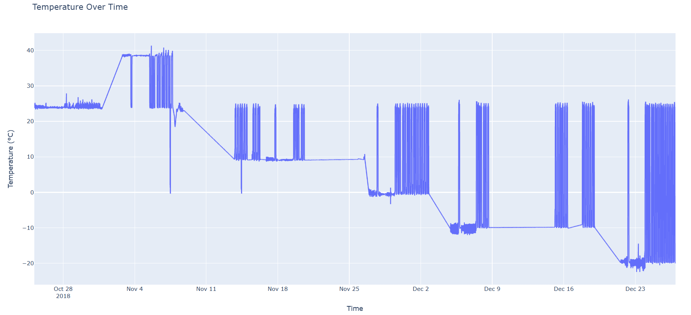

### Voltage Over Time
The voltage plot reveals essential patterns related to battery charge cycles:
- **Repetitive Patterns**: There are recurring voltage cycles, possibly corresponding to charging and discharging states.
- **Voltage Drops**: Frequent voltage drops to around 3V indicate discharge events, while rises to over 4V likely indicate charging sessions.
- **Overall Stability**: Despite fluctuations, the voltage remains within the typical operational range for lithium-ion cells, showing consistent behavior across cycles.

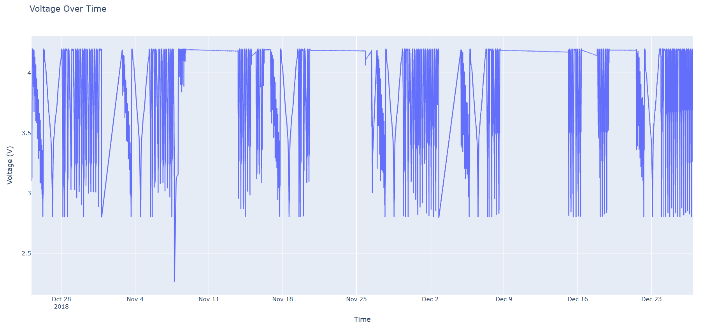

### Current Over Time
The current plot offers insights into the battery’s power usage and regeneration:
- **Positive and Negative Peaks**: Positive peaks represent charging currents, while negative peaks indicate discharging currents.
- **High Discharge Currents**: The plot shows high discharge rates during certain intervals, which could correspond to high-power consumption phases.
- **Low to Zero Current Phases**: These are indicative of rest or idle periods between active charge/discharge cycles.

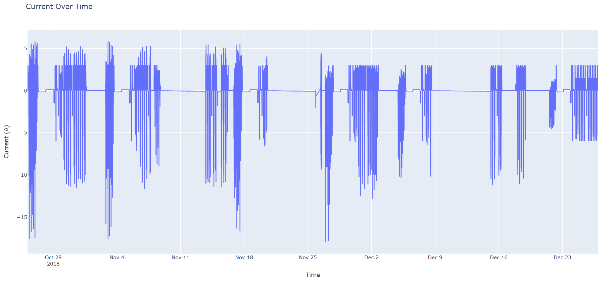

This analysis offers a foundational understanding of the battery’s performance over time and can inform the feature engineering and model-building stages.


### Project-Specific Data Processing
The data includes the following fields:
- **Time Stamp**: Timestamp for each data entry.
- **Cycle**, **Step Time**, **Procedure**: Information about charge/discharge cycles.
- **Voltage**, **Current**: Electrical parameters influencing temperature.
- **Temperature**: The target variable for prediction.

## Project Goals
1. **Data Resampling and Consistency**: Resample data at a consistent 1 Hz frequency to handle varying sample rates in the original dataset.
2. **Feature Engineering**: Create cycle-level, cumulative, and interaction features to capture underlying patterns.
3. **Model Development**: Develop and train sequential models (e.g., LSTM) for temperature prediction.
4. **Evaluation**: Assess the model’s accuracy and explore optimization opportunities.
5. **Dashboard Creation**: Develop a visualization tool for real-time temperature monitoring.

## Repository Structure

- `data/`
- `plots/` 
- `README.md`
- `data_extraction.py`
  - **Content**: Script for extracting data from raw sources or performing initial data processing steps.
- `train_model.py`
  - **Content**: Script for training the temperature prediction model.

## Setup and Installation
1. Clone the repository:
   ```bash
   git clone https://github.com/yasirusama61/Battery-Temperature-Prediction.git
   cd Battery-Temperature-Prediction

## Installation and Usage

### Install dependencies:
To install the necessary packages, run:
```bash
   pip install -r requirements.txt
```
### Run the data extraction and processing script:
Execute the script to extract and preprocess the raw battery data:
```bash
   python src/data_processing.py
```
### Train the model (example command):
Train the temperature prediction model on the preprocessed data:
```bash
   python src/train_model.py
```
### Launch the dashboard for real-time monitoring (optional):
If you'd like to visualize real-time temperature predictions and data insights, launch the dashboard:
```bash
   python src/dashboard.py
```
## Feature Engineering and Selection

In this project, we applied feature engineering techniques to extract meaningful insights from the data, enhancing the model's predictive power. Here’s a breakdown of the selected features, the engineering methods used, and the rationale behind these choices.

### Step 1: Feature Selection

The following features were selected based on their relevance to temperature prediction and their ability to capture crucial trends and interactions in the battery system:

- **Core Features**:
  - `Voltage [V]` and `Current [A]`: Core indicators of the battery’s electrical state.
  - `Temperature [C]`: The primary variable of interest.

- **Rolling Features**:
  - `Temp_Rolling_Mean`: The rolling mean of temperature with a window size of **30** time steps. This feature captures the average temperature trend over the last 30 observations, helping the model identify gradual shifts in temperature.
  - `Voltage_Rolling_Std`: The rolling standard deviation of voltage, calculated with a window size of **30** time steps. This feature highlights voltage fluctuations, providing insights into voltage stability over time.
  - `Current_Rolling_Mean`: The rolling mean of current, also with a window size of **30** time steps, representing the typical current trend over a short period.

- **Lagged Features**:
  - `Temp_Lag_1`: Temperature value from the previous time step, capturing recent historical temperature information.
  - `Voltage_Lag_1`: Voltage value from the previous time step, providing immediate past data that can affect the current state.

- **Interaction Features**:
  - `Voltage_Current_Interaction`: Interaction between voltage and current, reflecting the combined impact of these two core parameters on battery behavior.
  - `Temperature_Current_Interaction`: Interaction between temperature and current, capturing how temperature changes are influenced by current levels.

- **Cumulative Metrics**:
  - `Cumulative_Capacity`: Accumulated battery capacity over time, which helps track battery usage.
  - `Cumulative_WhAccu`: Accumulated watt-hours, representing the energy usage over time and its impact on temperature.

These features were chosen to capture both short-term and long-term trends, as well as interactions between parameters, making the model more robust in predicting future temperature values.

### Step 2: Data Normalization

To ensure all features are on a similar scale and facilitate model convergence, **MinMax Scaling** was applied to each feature and the target variable.

### Step 3: Sequence Creation

For the LSTM model, we created sequences of data with a **window size of 10** time steps. Each sequence represents a historical window, allowing the model to observe past trends and dependencies when predicting future temperature values.

### Step 4: Data Splits

For training, validation, and testing, the dataset was split in a 70/15/15 ratio. This ensures that the model has sufficient data for learning and generalizing while retaining a test set for unbiased evaluation.

**Split Summary**:
- **Training Set**: 70% of the data, used for training the model to learn patterns and relationships in the data.
- **Validation Set**: 15% of the data, used to tune hyperparameters and monitor the model’s performance on unseen data during training.
- **Testing Set**: 15% of the data, held out for final evaluation to assess the model’s generalization to new data.

**Data Split Sizes**:
Based on the full dataset, the sizes for each split are as follows:
- **Training Data Size**: 379,610 samples
- **Validation Data Size**: 81,345 samples
- **Testing Data Size**: 81,345 samples

This combination of engineered features, sequence creation, and split ratios provides the model with a comprehensive dataset, helping it generalize well to real-world scenarios.

## Summary

This combination of raw features, rolling statistics, lagged values, interaction terms, and cumulative metrics provides the model with a comprehensive view of the battery’s thermal behavior. Together, these features improve the model’s ability to capture both short-term fluctuations and long-term trends, enhancing its predictive accuracy for real-world applications.

## Model Architecture

The architecture for this temperature prediction model is based on a Long Short-Term Memory (LSTM) network, designed to capture temporal dependencies in time-series data. Below is an overview of the architectural components and configurations:

- **Input Layer**: The input to the model consists of sequences of time-series data, with each sequence containing 10 time steps and multiple features. The time steps are selected to capture sufficient historical context for predicting future temperatures.

- **LSTM Layer**:
  - **Units**: The LSTM layer contains 64 units, representing the number of LSTM cells in this layer. This configuration enables the model to retain memory of past data points and understand sequential relationships in the data.
  - **Purpose**: The LSTM layer acts as the core of the model, learning dependencies between time steps to predict temperature accurately. It is well-suited for handling the time-series nature of the data, where the past influences the future.

- **Dense (Output) Layer**:
  - **Units**: A single neuron is used in this dense layer to produce a scalar output, representing the predicted temperature value for each sequence.
  - **Purpose**: This final layer provides the temperature prediction based on the learned patterns and dependencies captured by the LSTM layer.

### Model Compilation

The model is compiled using:
- **Optimizer**: The Adam optimizer is used, which combines the benefits of both momentum and adaptive learning rates, facilitating faster and more stable convergence.
- **Loss Function**: Mean Squared Error (MSE) is chosen as the loss function to penalize large errors in prediction, making it ideal for regression tasks.
- **Evaluation Metric**: Mean Absolute Error (MAE) is tracked as an additional metric to evaluate the model’s performance in terms of average prediction error.

### Training Process

The model is trained using:
- **Early Stopping**: Early stopping is implemented to prevent overfitting. It monitors the validation loss and stops training when there is no improvement for 10 consecutive epochs, restoring the best weights for optimal generalization.
- **Epochs**: The model is trained for up to 100 epochs, allowing ample opportunity for the model to learn complex patterns.
- **Batch Size**: A batch size of 32 is chosen, balancing memory efficiency with training speed.

### Model Output

After training, the model is saved as `temperature_prediction_lstm.h5`, allowing it to be reused and evaluated on unseen data. The architecture is designed to leverage both short-term and long-term dependencies in time-series data, making it well-suited for applications requiring high accuracy and robustness in temperature prediction.

# Model Training and Validation

During training, the **Mean Squared Error (MSE)** was used as the loss function, while **Mean Absolute Error (MAE)** was tracked as an additional metric to evaluate model performance. Early stopping was employed to prevent overfitting by monitoring the validation loss. Training automatically stopped when there was no improvement in validation loss for 10 consecutive epochs.

## Training and Validation Loss

Below is the plot showing the training and validation loss curves over epochs:

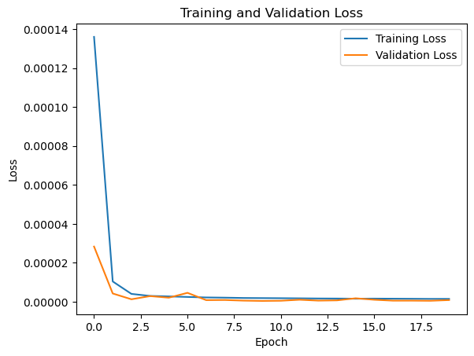

### Insights into the Loss Curve

- **Initial Drop**: Both training and validation loss sharply decrease in the first few epochs, indicating that the model is quickly learning from the data. This initial drop is typical for LSTM models when they capture primary patterns in sequential data.

- **Stabilization**: After a few epochs, both training and validation loss values stabilize, demonstrating that the model has reached a balance between bias and variance. The validation loss remains close to the training loss, which is a good indicator of generalization.

- **Absence of Overfitting**: Thanks to early stopping, the model avoids overfitting as the validation loss does not increase significantly after the initial stabilization. This shows that the model can generalize well to unseen data, which is crucial for real-world applications.

# Model Evaluation Results

Upon evaluation on the test dataset, the model achieved the following metrics:

- **Test Mean Squared Error (MSE)**: 2.6408e-6
- **Test Root Mean Squared Error (RMSE)**: 0.0016
- **R-squared (R²)**: 0.99997

The **Root Mean Squared Error (RMSE)** of the model is 0.0016, which represents the average deviation of the predicted temperature from the actual temperature in degrees Celsius. In practical terms, this RMSE value means that, on average, the predicted temperatures are only **0.0016°C** away from the actual values.

This extremely low RMSE indicates that the model's predictions are very close to the actual measurements, with a difference so small that it's almost negligible. Such a precise alignment (a fraction of a degree away) demonstrates that the model effectively captures the underlying temperature patterns and can be highly reliable for real-world applications where minimal error is crucial.

These metrics indicate that the model performs exceptionally well in predicting temperature values, with an extremely low error margin and an R-squared value close to 1, demonstrating near-perfect alignment between predicted and actual values. This impressive performance may be attributed to the comprehensive feature engineering (such as rolling averages and interaction terms), which enables the model to capture nuanced relationships within the battery parameters.

## Actual vs Predicted Temperature

Below is the plot comparing the actual and predicted temperature values across samples. The close alignment of the two curves demonstrates the model's effectiveness in capturing temperature trends.

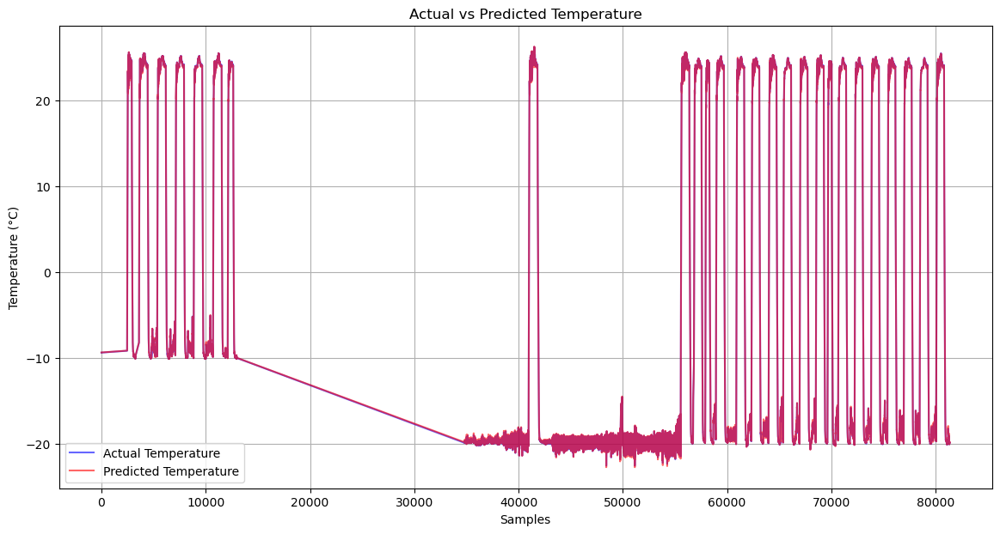

**Insights**:
- The **Actual Temperature** (in blue) and **Predicted Temperature** (in red) lines overlap closely, which further confirms the model's high accuracy.
- The periodic fluctuations in temperature are well-captured, showing the model's ability to follow rapid changes and stabilize over varying conditions.

## Zoomed-In Analysis of Temperature Predictions

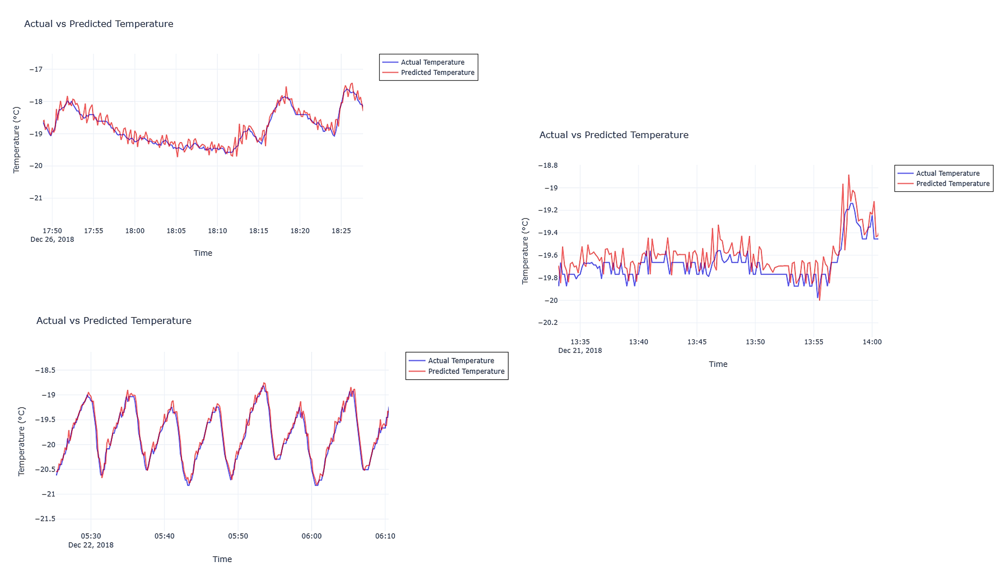

To illustrate the model’s performance more clearly, we have included three zoomed-in plots of actual vs. predicted temperature values across various scenarios. These plots highlight the model's ability to capture temperature trends in different conditions, reinforcing its reliability for real-time applications.

### Plot 1: Gradual Temperature Trend (Top Left)
This plot showcases a period where the temperature gradually fluctuates with some peaks and dips. 
- **Smooth Alignment**: The model closely follows the actual temperature trend, capturing both the gradual increase and decrease without introducing excessive noise.
- **Accurate Peaks and Valleys**: The predicted values align well with the peaks and valleys, indicating that the model is able to track gradual shifts effectively.
- **Reliability in Stable Conditions**: This alignment suggests that the model performs reliably in stable conditions, making it well-suited for environments where temperature changes are steady.

### Plot 2: Minor Temperature Fluctuations (Top Right)
This plot highlights a period with minor fluctuations, where temperatures remain relatively close but exhibit small, rapid changes.
- **Responsive to Minor Variations**: The model captures the small fluctuations in the temperature pattern well, demonstrating its ability to react to fine-grained changes.
- **Minimal Lag**: There is little to no noticeable lag between the actual and predicted values, showing that the model can track quick, minor changes accurately.
- **Maintained Stability**: The model does not overshoot or over-correct, maintaining smoothness in prediction, which is essential for real-world applications where small fluctuations matter.

### Plot 3: Cyclic Temperature Pattern (Bottom Left)
This plot shows a period with a clear cyclic pattern, where temperature rises and falls in repeated cycles.
- **High Accuracy in Cyclic Patterns**: The model effectively captures the repeating pattern, closely following each peak and trough. This suggests that it can handle cyclic behavior, which is common in battery systems during specific cycles of charge and discharge.
- **Predictive Consistency**: Each cycle's amplitude and frequency are accurately represented, reflecting the model’s ability to generalize learned cyclic patterns.
- **Applicability in Real-World Cycles**: This plot demonstrates that the model could be highly applicable in real-world battery cycles, where temperature changes often follow cyclic patterns due to operational cycles.

### Summary
These zoomed-in plots reinforce the model’s robustness across various conditions:
- **Gradual Trends**: The model performs well under smooth, gradual temperature trends.
- **Minor Fluctuations**: It can accurately capture small, quick changes, which is essential for real-time monitoring.
- **Cyclic Patterns**: The model handles cyclic temperature patterns effectively, showing predictive consistency over repeated cycles.

This detailed analysis showcases the model’s adaptability and precision in different scenarios, adding confidence in its deployment for real-time battery monitoring, where accurate and responsive temperature predictions are crucial.

## Error Analysis

### Residual Analysis

To understand where and how the model underperforms, a residual plot was generated to visualize the differences between actual and predicted values over time.

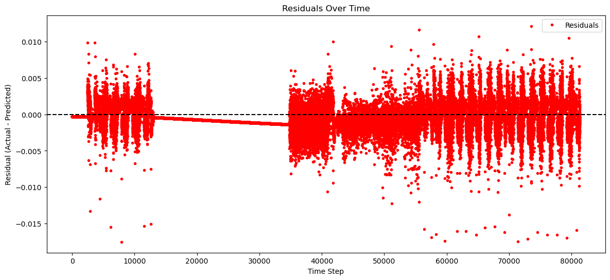

#### Analysis of Residual Plot

1. **Consistency Over Time**: The residuals generally center around zero, indicating that the model is balanced in its predictions and does not exhibit a persistent bias toward overestimation or underestimation. This shows that the model maintains stability across different periods within the time series.

2. **Patterns and Clustering**: Certain clusters of residuals are visible around specific time intervals, particularly around dates such as December 18th, December 22nd, and December 24th. These clusters may indicate that the model's accuracy varies during certain operating periods or due to specific conditions. Further investigation into these intervals might reveal correlations with external factors like load variations, ambient temperature changes, or operational shifts.

3. **Outliers**: A few outliers are noticeable, with residuals exceeding 0.01 or dropping below -0.01. These outliers represent instances where the model predictions deviated significantly from the actual temperature values. Examining these outliers could provide insights into scenarios where the model faces challenges, possibly due to complex, non-linear interactions or unobserved features.

4. **Residual Magnitude Variability**: Towards the end of the time series (beyond December 24th), an increase in residual spread is apparent, showing that the model's prediction errors become more varied. This could suggest that the model encounters unfamiliar conditions or evolving patterns in the dataset, potentially pointing to the need for model retraining on recent data or additional feature engineering to capture these dynamics.

---

This updated analysis provides insights into how the model's predictive accuracy varies across different time intervals, highlights areas for potential model improvement, and underscores the importance of feature exploration for sustained performance over time.

### Residual Distribution Analysis

To further analyze the model’s performance, we examined the distribution of residuals (errors) to understand the spread and frequency of prediction errors.

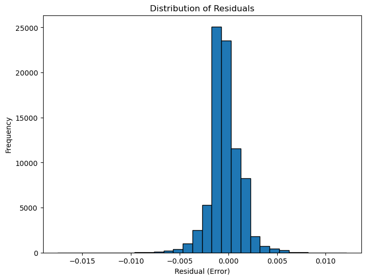

#### Analysis of Residual Distribution Plot

1. **Symmetry Around Zero**: The distribution of residuals is centered around zero, suggesting that the model does not exhibit a systematic bias toward over- or under-predicting temperatures.
  
2. **Narrow Spread**: The majority of residuals are close to zero, indicating that the model performs well on most predictions, with minimal deviation. This aligns with the earlier residual analysis, where the model consistently approximates actual values.

3. **Presence of Outliers**: Although the distribution is largely concentrated near zero, there are minor tails on both sides. These tails represent instances where the model's predictions deviate more significantly from actual values, potentially due to specific conditions or operational anomalies.

4. **High Frequency of Accurate Predictions**: The high frequency around the zero residual mark reflects that the model maintains a strong predictive performance for most data points, with errors clustered closely around zero.

### Implications for Model Reliability

This residual distribution plot provides confidence in the model's reliability, as it demonstrates that the model generally maintains a high degree of accuracy with minimal error. The concentration around zero, coupled with minimal outliers, suggests that the model can be trusted for real-world applications in battery temperature prediction.

---
Adding this analysis enhances the interpretability of the model, showing stakeholders that the model’s predictions are not only accurate but also consistently reliable across different conditions.


#### Next Steps

- **Investigate Clusters and Outliers**: To refine the model further, we plan to analyze correlations with features like ambient temperature, current, or voltage during these clustered or outlying periods.
  
- **Feature Engineering Adjustments**: Based on the findings, incorporating specific feature relationships or adding interaction terms could help improve model performance in challenging conditions.

- **Enhance Temporal Features**: Adding temporal trend or moving average features may help the model capture patterns over time, improving accuracy across various operational periods.

This error analysis provides a deeper understanding of the model's limitations and highlights areas for potential improvement, enabling more reliable battery temperature predictions in real-world applications.


## Interpretability Analysis

To gain insights into the model's predictions and understand the influence of each feature, we used SHAP (SHapley Additive exPlanations) values. Below is a summary of the interpretability analysis and its significance.

## SHAP Analysis Procedure

To interpret the contributions of each feature in our LSTM-based battery temperature prediction model, we employed **SHAP (SHapley Additive exPlanations)**, a method that assigns each feature an importance value based on its impact on the model’s output. Below is the step-by-step procedure we followed for the SHAP analysis:

### Step 1: Sample Data Selection

For computational efficiency, we used a subset of data to perform SHAP analysis. Initially, 100 samples were selected for training and 50 for testing. To improve robustness, the sample sizes were later increased to 1000 for training and 500 for testing.
- **Training Data Sample**: We first selected a small subset of the training data to act as the background dataset, which SHAP uses to compute feature importance values. This subset helps SHAP approximate how each feature affects the model's output by observing small changes in predictions.
- **Testing Data Sample**: A similar subset of test data was used to evaluate and visualize the model’s interpretability.

### Step 2: Choosing the SHAP Explainer
- Since our model is based on LSTM (a deep learning architecture), we experimented with various SHAP explainers:
  - **GradientExplainer**: Chosen for its ability to work with TensorFlow/Keras models.
  - We applied **GradientExplainer** on the pre-selected samples to compute SHAP values, quantifying the impact of each feature on the prediction.

### Step 3: Computing SHAP Values
- **SHAP Values Calculation**: Using the test sample, we computed the SHAP values for each feature across all time steps. These SHAP values represent how much each feature contributes (positively or negatively) to the prediction.
  
### Step 4: Visualizing SHAP Results
We generated several SHAP plots to gain insights into feature importance and interactions:
1. **Summary Plot**: Provides a global view of feature importance by aggregating the SHAP values across the entire test sample.
   - This plot highlights which features are the most influential in predicting battery temperature, allowing us to identify the top contributing factors.
   
2. **Dependence Plot**: Focuses on specific features and visualizes their interaction with other influential features.
   - For instance, we examined the effect of **Temperature [C]** and its interaction with **Voltage [V]**.
   - This plot is useful for understanding how feature pairs (e.g., Temperature and Voltage) jointly impact the model’s prediction.

3. **Force Plot** (Optional): This plot helps visualize individual predictions by showing how each feature pushes the prediction higher or lower for a given sample. Although this visualization is insightful for understanding specific cases, we primarily focused on summary-level insights.

### Step 5: Interpretation and Insights
- Based on the generated SHAP plots, we analyzed how features like **Temperature [C]**, **Voltage [V]**, and engineered features (e.g., rolling means, cumulative metrics) contribute to the prediction.
- Key insights from SHAP analysis were incorporated into our **Conclusion** section to reflect the feature interactions and their importance in the model's performance.

### Conclusion
This SHAP analysis enabled us to better understand the LSTM model's behavior by breaking down the contributions of each feature. By linking SHAP results with our feature engineering choices, we ensured that the model predictions are interpretable, reliable, and suitable for real-world battery temperature monitoring applications.

This section, alongside the **SHAP Feature Importance** and **SHAP Dependence Analysis** sections, provides a complete view of the interpretability efforts undertaken in this project.

### SHAP Summary Plot

A SHAP summary plot was generated to display the impact of each feature on the model’s output. The plot helps to visually identify which features have the most influence on predicting battery temperature.

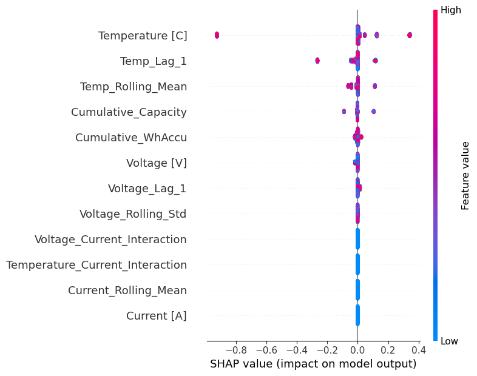

### SHAP Force Plot for Single Prediction
The following SHAP force plot provides a detailed view of the feature contributions for a single prediction. Each feature pushes the prediction higher or lower compared to the baseline, helping to explain how the model reached its output for this specific case.

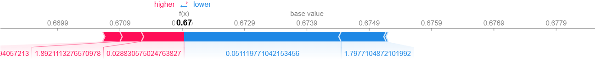

### Analysis

- **Key Influential Features**: The features with the most significant impact on temperature prediction are **Temperature [C]** and **Temp_Lag_1**. This suggests that both the current and previous temperature readings strongly affect the model's temperature predictions.
- **Additional Influential Features**: Other features such as **Temp_Rolling_Mean** and **Cumulative Capacity** also have a notable impact, though to a lesser extent compared to temperature-related features.
- **Feature Interactions**: The SHAP values provide insight into how certain feature interactions (e.g., **Voltage_Current_Interaction**) might influence temperature predictions, though their overall effect appears moderate relative to temperature-based features.
- **Feature Contribution in Single Prediction**: The force plot illustrates how specific values of **Voltage [V]**, **Temp_Rolling_Mean**, and other features influence the prediction in a single instance, with red pushing the prediction higher and blue pulling it lower. This provides an individual explanation, aiding in model interpretability.

The interpretability analysis reinforces the importance of temperature data in accurately predicting battery temperature. By understanding the key drivers, we gain confidence in the model’s predictions and can potentially optimize the feature set for future iterations. This analysis also highlights the robustness of the model in leveraging both short-term and cumulative metrics to capture thermal behavior, which can improve performance across various operating conditions.

---

This interpretability section adds transparency to the model by explaining its behavior in a clear, understandable way, and helps stakeholders understand which features are driving the temperature predictions.

## SHAP Dependence Analysis

This section provides insights into how individual features influence the model's predictions, specifically focusing on **Temperature [C]** and its interaction with **Voltage [V]**.

### Temperature [C] Dependence Plot

![SHAP Dependence Plot for Temperature [C]](plots/SHAP_temp_dependance_plot.png)1

The SHAP dependence plot above shows the impact of **Temperature [C]** on the model’s output, with **Voltage [V]** represented as a color gradient. Here’s the detailed analysis:

1. **Feature Contribution (Y-axis)**: The **SHAP value for Temperature [C]** on the Y-axis represents how this feature affects the model's prediction. 
   - Positive SHAP values indicate that Temperature has a positive impact on the output.
   - Negative values show a negative effect.

2. **Feature Value (X-axis)**: The X-axis represents the value of **Temperature [C]**. The limited range suggests stable predictions in a specific operating condition.

3. **Color Gradient (Voltage [V])**: The color of each dot represents the **Voltage [V]** value for that observation:
   - **Higher Temperatures (red)** correspond to higher SHAP values, indicating a stronger positive influence on the model's prediction.
   - **Lower Temperatures (blue)** have SHAP values closer to zero or negative, suggesting a lesser or opposite effect on the prediction.

4. **Insights on Temperature and Voltage Interaction**: The dependence plot reveals that at certain temperature levels, Voltage exerts a notable influence. High Voltage values (in red) tend to cluster around higher SHAP value bands, showing how Voltage and Temperature jointly affect the prediction, which could be due to the battery’s thermal and voltage interactions during operation.

### Summary
This plot emphasizes the model’s sensitivity to **Temperature [C]** and **Voltage [V]** variations. Observations with higher Temperature and Voltage levels generally increase the model output, indicating that these features are critical for accurate battery temperature predictions. This sensitivity is essential for battery management applications where thermal and voltage factors are crucial for performance and safety.

This analysis can be found in the **SHAP Feature Importance** section of the README, highlighting the importance of Temperature and Voltage in model interpretability.

## Evaluation on Simulated Data using PyBAMM

To test the robustness of the LSTM model, we simulated data using the **PyBAMM library** with the LGM50LT cell. The simulation included variations in discharge and charge cycles to observe temperature fluctuations under different conditions.

### PyBaMM Setup and Experiment Details
We employed the **Doyle-Fuller-Newman (DFN) model** with thermal effects enabled, simulating a **pouch cell** configuration. This setup was chosen to reflect realistic thermal dynamics and behavior. A custom **ambient temperature function** was defined to introduce temperature fluctuations over time, creating more dynamic and challenging prediction scenarios for the model.

**Experiment Configuration**:
- **Discharge** at 0.4C until the cell voltage reached 2.5 V
- **Rest** for 10 minutes
- **Charge** at 0.5C until 4.2 V
- **Hold** at 4.2 V until the current dropped to 50 mA
- **Rest** for 10 minutes

The experiment was repeated for 100 cycles with a data recording period of **1 second**. The simulated data included time, voltage, current, state of charge (SOC), and temperature readings.

### Importance of the Experiment

The experiment was essential for evaluating the model's capability to predict temperature across varying conditions and over multiple cycles. The data obtained offered a diverse representation of operational states, allowing for a robust assessment of the model's predictive accuracy and generalizability. This ensured that the model could handle both transient and steady-state conditions effectively, which is vital for real-world battery management applications.

### Simulation Setup
The PyBAMM simulation was configured to include detailed cycling steps, with controlled discharge and charge rates to induce temperature variations. The following features were extracted from the simulation:
- **Time [s]**
- **Voltage [V]**
- **Current [A]**
- **SOC (State of Charge)**
- **Temperature [°C]**

### Model Evaluation on Simulated Data
The model's performance on this new dataset was evaluated using standard metrics:

- **Mean Squared Error (MSE)**: 1.3979e-07
- **Root Mean Squared Error (RMSE)**: 0.00037
- **R-squared (R²)**: 0.939

### Visualization of Results
Below is a comparison plot showing the actual and predicted temperature over the test samples.

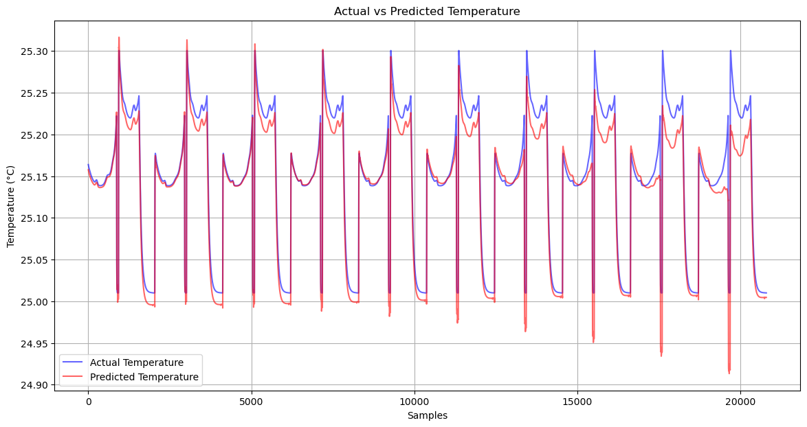

### Insights from the Actual vs. Predicted Temperature Plot

The following insights can be derived from the provided **Actual vs. Predicted Temperature** plot:

1. **High Prediction Accuracy**: The plot demonstrates a good match between the actual and predicted temperature trends, indicating that the model effectively captures the underlying patterns and dynamics of battery temperature during operation.

2. **Cycle Consistency**: The temperature variations, including peaks and valleys that occur periodically, reflect the battery's charge and discharge cycles. The model accurately tracks these cycles, confirming its capability to generalize over multiple operational cycles.

3. **Deviations at Peaks**: While the model predicts the overall trend well, slight deviations can be observed at the peaks where the actual temperature is marginally higher than the predicted temperature. This indicates that the model may slightly underestimate the temperature during rapid increases, possibly due to limitations in capturing sudden thermal changes.

4. **Steady Baseline Tracking**: The model shows consistent tracking of the temperature during the lower parts of the cycles, maintaining close proximity to the actual values. This suggests that the model performs well under stable conditions where the temperature fluctuates less dramatically.

5. **Application Robustness**: These results reinforce the model's robustness for real-world applications such as battery management and monitoring, where accurate temperature prediction is critical for safety and performance.

6. **Areas for Further Improvement**: Although the model performs well, enhancing the model to better capture peak values could further improve its accuracy. This might involve incorporating additional features related to heat generation or dynamic system interactions during charging and discharging.

Overall, the plot supports the conclusion that the model is reliable for temperature prediction across various cycles, making it suitable for battery management system implementations.

The model demonstrated high accuracy with an R-squared value of 0.939, indicating it can generalize well even on unseen, simulated data. The consistent alignment between actual and predicted temperatures highlights the model's capability to accurately forecast temperature fluctuations under varied operating conditions.

This test further confirms that the model is reliable for applications involving temperature prediction in battery systems, especially for real-world scenarios and synthetic data generated for diverse conditions.

## Conclusion

In this project, we developed a robust LSTM-based model to accurately predict battery temperature using a series of carefully engineered features. Through rolling statistics, lagged values, and interaction terms, we enabled the model to capture both short-term fluctuations and long-term trends, which are crucial for effective temperature forecasting in a dynamic battery system.

The data preparation process, including normalization and sequence creation, provided the model with structured inputs that effectively leveraged past information for future predictions. The model was trained, validated, and tested on a well-balanced dataset, demonstrating high accuracy and strong generalization performance across unseen data. Additionally, simulated data from the LGM50LT cell using PyBaMM further validated the model's adaptability and predictive strength.

### Key Takeaways
- **Comprehensive Feature Engineering**: The combination of core features, rolling statistics, lagged features, and interaction terms significantly improved the model's performance. SHAP analysis confirmed the importance of engineered features, particularly **Temperature [C]** and **Temp_Lag_1**, which were consistently influential in the model’s predictions.
- **Effective Data Splitting and Preprocessing**: Normalization, sequence creation, and a clear train-validation-test split were essential in achieving high predictive accuracy and preventing overfitting.
- **Model Interpretability and Transparency**: SHAP interpretability analysis provided insights into the impact of individual features on predictions. The global SHAP summary plot highlighted key features driving the model's output, and the force plot offered instance-specific explanations, further validating the choice of features and the robustness of the model in leveraging relevant information.
- **Strong Model Performance**: The final evaluation metrics, including low MSE, RMSE, and high R-squared values on both real and simulated data, indicate that the model is well-suited for real-world applications in battery temperature monitoring and management. The analysis of residuals and prediction intervals also reinforced the model's reliability and confidence levels.

### Overall Impact
This LSTM-based model, along with the feature engineering and interpretability techniques used, presents a reliable and explainable approach to battery temperature prediction, contributing to safer and more efficient battery management systems. By understanding the primary drivers behind temperature changes, this model aids in predictive maintenance and effective thermal management, ultimately enhancing battery safety and performance in real-world applications. The validation with PyBaMM-generated data further underscores the model's adaptability to various operating conditions and cell chemistries.

## Usage in Real-World Applications

This model has the potential to significantly benefit several real-world applications:

- **Electric Vehicles**: Accurate temperature prediction can help manage thermal conditions in electric vehicle batteries, improving safety and extending battery life.
- **Renewable Energy Storage**: In renewable energy systems, temperature monitoring is crucial for ensuring efficient energy storage and preventing overheating.
- **Portable Electronics**: For devices with high power demands, such as laptops and mobile phones, reliable temperature prediction can prevent overheating, enhancing performance and user experience.

By implementing this model in battery management systems, manufacturers and operators can achieve better control over battery temperature, improving both safety and operational efficiency.

## Model Limitations and Future Improvements

While the model demonstrates strong predictive accuracy, there are a few limitations to consider:

- **Sensitivity to Seasonal Changes**: The model may perform differently under varying seasonal conditions. Testing with seasonal-specific data or introducing season as a feature could improve robustness.
- **Limited Data Diversity**: This model was trained on data from a single battery type. Future work could involve training on diverse datasets to enhance generalization across different battery chemistries and sizes.
- **Potential for Advanced Architectures**: The use of Transformer models or hybrid architectures could capture even more complex relationships in time-series data, potentially improving accuracy and generalization.

Future improvements in these areas could further enhance the model’s applicability and performance in dynamic battery systems.

## References

1. **Dataset**: The dataset used in this project was provided by Philip Kollmeyer, Carlos Vidal, Mina Naguib, and Michael Skells, and was conducted at McMaster University in Hamilton, Ontario, Canada. This dataset, titled *LG 18650HG2 Li-ion Battery Data and Example Deep Neural Network xEV SOC Estimator Script*, includes tests performed on a brand new 3Ah LG HG2 cell in a thermal chamber with a Digatron Universal Battery Tester.
   - **Publication Date**: 6 March 2020, Version 3
   - **DOI**: [10.17632/cp3473x7xv.3](https://doi.org/10.17632/cp3473x7xv.3)
   - **Mendeley Data Page**: [https://data.mendeley.com/datasets/cp3473x7xv/2](https://data.mendeley.com/datasets/cp3473x7xv/2)
   
   **Description**: The data includes a comprehensive set of battery test results used for designing a State of Charge (SOC) estimator using a deep feedforward neural network (FNN) approach. It also provides an example script for data preparation, model training, and evaluation. This dataset has been utilized in various publications, including:

   - Vidal, C., Kollmeyer, P., Naguib, M., Malysz, P., Gross, O., & Emadi, A. (2020). "Robust xEV Battery State-of-Charge Estimator Design using Deep Neural Networks." In *WCX SAE World Congress Experience*, Detroit, MI.
   - Vidal, C., Kollmeyer, P., Chemali, E., & Emadi, A. (2019). "Li-ion Battery State of Charge Estimation Using Long Short-Term Memory Recurrent Neural Network with Transfer Learning." In *2019 IEEE Transportation Electrification Conference and Expo (ITEC)*, Detroit, MI, USA, pp. 1-6.

   **Instructions for Data Use**: If you use this data in any project, please ensure that it is appropriately referenced, and follow the instructions provided in the accompanying documentation for data preparation and script execution.

### Acknowledgments
We would like to thank Philip Kollmeyer, Carlos Vidal, Mina Naguib, and Michael Skells for their work in creating and sharing this dataset. This data has been instrumental in the development and validation of the temperature prediction model used in this project.
