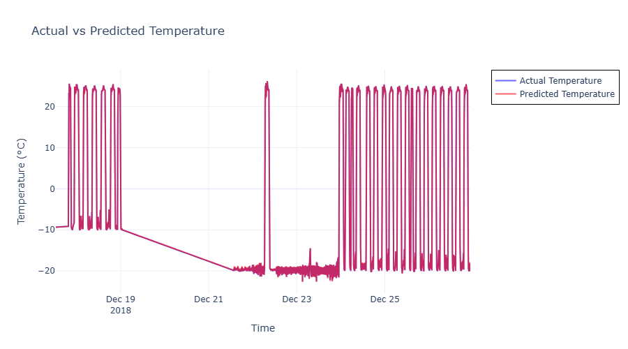

# 🌡️ **Battery Temperature Prediction**

[](https://www.python.org/)
[](#)
[](#)
[](#)
[](#)

---

This project focuses on predicting the temperature of an **LG 18650HG2** battery cell using parameters such as voltage, current, and cycle information. The primary objective is to develop a robust temperature prediction model to aid battery management systems in **anticipating overheating risks** and enhancing battery performance.

---

## 📝 Project Overview

Temperature is a critical factor affecting the **safety** and **efficiency** of lithium-ion cells. This project employs advanced modeling techniques on time-series data to predict battery temperature. Unique features are engineered to capture cycle-specific behaviors, accumulated energy, and thermal variations, enabling accurate predictions essential for optimal battery management.

---

## 📊 Data Description

### 📄 Original Data Source

The dataset used in this project originates from research conducted at **McMaster University**, Ontario, Canada. It is publicly accessible on Mendeley Data ([link](https://data.mendeley.com/datasets/cp3473x7xv/2)), contributed by Dr. Phillip Kollmeyer and colleagues as part of their work on **State-of-Charge (SOC) estimation** for lithium-ion batteries using a **deep feedforward neural network (FNN)**.

**Original Data Citation**:
- Philip Kollmeyer, Carlos Vidal, Mina Naguib, Michael Skells. *LG 18650HG2 Li-ion Battery Data and Example Deep Neural Network xEV SOC Estimator Script*. Published: March 6, 2020. DOI: [10.17632/cp3473x7xv.3](https://doi.org/10.17632/cp3473x7xv.3)

The data was collected from an LG 18650HG2 battery cell tested in a **thermal chamber** and analyzed with a **Digatron Universal Battery Tester**.

---

### 📈 Summary Statistics of Data

The table below provides a summary of the main variables in the dataset, showcasing key statistical indicators such as **mean**, **standard deviation**, **minimum**, **maximum**, and **quartiles**.

| **Statistic**   | **Step**     | **Voltage [V]** | **Current [A]** | **Temperature [C]** | **Capacity [Ah]** | **WhAccu [Wh]** |
|-----------------|--------------|------------------|------------------|----------------------|-------------------|------------------|
| **Count**       | 5,423,272    | 5,423,272       | 5,423,272       | 5,423,272           | 5,423,272         | 5,423,272        |
| **Mean**        | 351.87       | 3.912           | 8.52e-3         | 8.35                | 0.1139            | 0.5481           |
| **Std**         | 799.02       | 0.3629          | 1.0469          | 16.6851             | 1.3026            | 4.9892           |
| **Min**         | 1            | 2.262           | -1.8001         | -22.5039            | -2.7807           | -10.3028         |
| **25%**         | 9            | 3.665           | -0.0407         | -9.6814             | -0.5800           | -2.1959          |
| **50%**         | 24           | 4.151           | 0.0             | 9.1625              | 0.0105            | 0.0457           |
| **75%**         | 44           | 4.187           | 0.0             | 23.8307             | 0.9399            | 3.6855           |
| **Max**         | 6,667        | 4.202           | 5.9993          | 41.3273             | 2.8180            | 10.9525          |

---

This data summary highlights the variability in **temperature**, **voltage**, and **current** across different battery cycles, providing insights into the thermal dynamics of the battery under various operating conditions. The features in this dataset will drive the model to make precise temperature predictions, enhancing battery safety and efficiency.

### 🔍 Observations and Analysis

1. **Voltage**:
   - Mean voltage is 3.91 V, typical for an LG 18650 cell.
   - Range: 2.26 V (discharged) to 4.20 V (fully charged).
   - Low standard deviation indicates stability across cycles.

2. **Current**:
   - Mean near zero (0.0085 A) shows balanced charge/discharge cycles.
   - Range: -1.80 A (discharge) to 5.99 A (charge), covering varied test conditions.
   - Higher standard deviation (1.05 A) reflects dynamic cycle variations.

3. **Temperature**:
   - Range: -22.50 °C to 41.32 °C, showing tests in diverse ambient conditions.
   - Mean of 8.35 °C with high standard deviation (16.68 °C), indicating fluctuations due to extreme conditions.

4. **Capacity (Ah)**:
   - Mean capacity of 0.1139 Ah, with a range up to 2.81 Ah (fully charged).
   - Negative minimum (-2.78 Ah) may indicate anomalies needing preprocessing.

5. **Accumulated Energy (WhAccu)**:
   - Mean of 0.548 Wh, ranging from -10.30 Wh to 10.95 Wh.
   - Negative values likely represent discharge cycles.

### 🔑 Insights for Modeling

- Broad data ranges and fluctuations in temperature, current, and capacity support robust model development.
- Preprocess negative values in capacity and energy to handle anomalies.
- Consider feature engineering for extreme conditions to enhance model accuracy.

## 🔍 Exploratory Data Analysis (EDA)

### 🌡️ Temperature Over Time
- **Early Stability**: Temperature is stable initially, indicating consistent conditions.
- **Sudden Increases**: Peaks above 40°C suggest charging or heavy usage.
- **Gradual Cooling**: Temperature decreases after peak activity, likely during rest phases.
- **Dynamic Cycles**: Repeated heating and cooling cycles reflect charge/discharge sessions.


---

### 🔋 Voltage Over Time
- **Repetitive Patterns**: Recurring cycles hint at charge/discharge states.
- **Voltage Drops**: Drops to ~3V indicate discharges; rises above 4V show charging.
- **Overall Stability**: Voltage remains within the normal operational range for lithium-ion cells.


---

### ⚡ Current Over Time
- **Positive and Negative Peaks**: Positive peaks show charging; negative peaks show discharging.
- **High Discharge Currents**: High discharge rates appear during certain intervals, indicating high power usage.
- **Idle Phases**: Low to zero current during rest or idle periods.


---

This analysis provides key insights into battery performance over time, useful for feature engineering and model development.

### 🔄 Project-Specific Data Processing

The dataset includes:
- **Time Stamp**: Timestamp for each entry.
- **Cycle**, **Step Time**, **Procedure**: Charge/discharge cycle details.
- **Voltage**, **Current**: Key electrical parameters.
- **Temperature**: Target variable for prediction.

---

## 🎯 Project Goals

1. **Data Resampling**: Standardize data to 1 Hz for consistency.
2. **Feature Engineering**: Create cycle-level, cumulative, and interaction features.
3. **Model Development**: Train sequential models (e.g., LSTM) for temperature prediction.
4. **Evaluation**: Measure model accuracy and identify improvement areas.
5. **Dashboard Creation**: Build a real-time temperature monitoring tool.

---

## 📂 Repository Structure

- `data/`: Contains datasets.
- `plots/`: Stores generated plots.
- `README.md`: Project documentation.
- `data_extraction.py`: Script for data extraction and initial processing.
- `train_model.py`: Script for training the temperature prediction model.

## ⚙️ Setup and Installation
1. Clone the repository:
   ```bash
   git clone https://github.com/yasirusama61/Battery-Temperature-Prediction.git
   cd Battery-Temperature-Prediction

## 📦 Installation and Usage

### Install dependencies:
To install the necessary packages, run:
```bash
   pip install -r requirements.txt
```
### Run the data extraction and processing script:
Execute the script to extract and preprocess the raw battery data:
```bash
   python src/data_processing.py
```
### Train the model (example command):
Train the temperature prediction model on the preprocessed data:
```bash
   python src/train_model.py
```
### Launch the dashboard for real-time monitoring (optional):
If you'd like to visualize real-time temperature predictions and data insights, launch the dashboard:
```bash
   python src/dashboard.py
```
## 🔧 Feature Engineering and Selection

In this project, we engineered and selected features to improve the model’s predictive accuracy for battery temperature. Below is a summary of key features and processing steps.

---

### 📝 Feature Selection

**Core Features**:
- `Voltage [V]` and `Current [A]`: Indicators of battery electrical state.
- `Temperature [C]`: Target variable.

**Rolling Features** (Window = 30 time steps):
- `Temp_Rolling_Mean`: Average temperature trend over recent observations.
- `Voltage_Rolling_Std`: Voltage stability over time.
- `Current_Rolling_Mean`: Short-term current trend.

**Lagged Features**:
- `Temp_Lag_1` & `Voltage_Lag_1`: Previous time-step values to capture recent history.

**Interaction Features**:
- `Voltage_Current_Interaction` & `Temperature_Current_Interaction`: Combined effects of voltage, current, and temperature on battery behavior.

**Cumulative Metrics**:
- `Cumulative_Capacity` & `Cumulative_WhAccu`: Track battery usage and energy consumption over time.

---

### 🔄 Data Normalization

Applied **MinMax Scaling** to all features and the target to ensure consistency and facilitate model training.

---

### 📐 Sequence Creation

For the LSTM model, sequences of data with a **window size of 10** were created, allowing the model to learn from past trends to predict future temperature values.

---

### 📊 Data Splits

Data split for training, validation, and testing in a **70/15/15** ratio:

- **Training**: 70% of data for learning patterns.
- **Validation**: 15% for hyperparameter tuning and performance monitoring.
- **Testing**: 15% for unbiased evaluation.

**Split Sizes**:
- **Training**: 379,610 samples
- **Validation**: 81,345 samples
- **Testing**: 81,345 samples

---

## 🏁 Summary

This combination of raw, rolling, lagged, interaction, and cumulative features equips the model with a comprehensive view of the battery's thermal behavior, enabling it to capture both short-term and long-term trends for more accurate temperature predictions in real-world scenarios.

## 🧠 Model Architecture

The temperature prediction model is built on a **Long Short-Term Memory (LSTM)** network, designed to capture temporal patterns in time-series data.

### Model Components

- **Input Layer**: Takes sequences of 10 time steps with multiple features, providing historical context for temperature predictions.
  
- **LSTM Layer**:
  - **Units**: 64 LSTM cells to capture sequential relationships.
  - **Purpose**: Core layer that learns dependencies over time, crucial for accurate temperature prediction.

- **Dense (Output) Layer**:
  - **Units**: Single neuron for scalar temperature output.
  - **Purpose**: Produces the temperature prediction from learned patterns.

---

### 🔧 Model Compilation

- **Optimizer**: Adam, for efficient learning with adaptive rates.
- **Loss Function**: Mean Squared Error (MSE), suited for regression tasks.
- **Evaluation Metric**: Mean Absolute Error (MAE), to gauge average prediction error.

---

### 🏋️‍♂️ Training Process

- **Early Stopping**: Stops training if validation loss doesn't improve over 10 epochs, preventing overfitting.
- **Epochs**: Up to 100 for learning complex patterns.
- **Batch Size**: 32, balancing speed and memory usage.

After training, the model is saved as `temperature_prediction_lstm.h5` for future evaluation on new data.

---

## 📉 Model Training and Validation

The model was trained with **MSE** as the loss and **MAE** as an evaluation metric. Early stopping ensured optimal generalization.

### Training and Validation Loss


#### 🔍 Insights into the Loss Curve

- **Initial Drop**: Rapid decrease in loss indicates quick learning of primary patterns.
- **Stabilization**: Training and validation loss stabilize, showing a balanced fit.
- **No Overfitting**: Validation loss remains close to training loss, confirming good generalization.

This architecture effectively captures short- and long-term dependencies, making it well-suited for accurate temperature predictions in real-world applications.

# 📊 Model Evaluation Results

Upon testing, the model achieved the following impressive metrics:

- **Test Mean Squared Error (MSE)**: 2.6408e-6
- **Test Root Mean Squared Error (RMSE)**: 0.0016
- **R-squared (R²)**: 0.99997

### 🏆 Model Performance Summary

The **RMSE** of 0.0016°C indicates that the model's predictions deviate from actual values by a negligible amount, demonstrating exceptional accuracy. The near-perfect **R²** score confirms that the model effectively captures underlying temperature patterns, making it highly reliable for real-world applications.

---

## 🔥 Actual vs Predicted Temperature

Below is a plot comparing actual and predicted temperatures:



**Insights**:
- **Overlap**: The actual (blue) and predicted (red) lines closely overlap, indicating high accuracy.
- **Pattern Capture**: The model effectively follows temperature fluctuations, making it suitable for dynamic conditions.

---

## 🔍 Zoomed-In Analysis


To highlight the model’s precision, here are three zoomed-in analyses:

### Plot 1: Gradual Trend
- **Smooth Alignment**: Tracks gradual shifts accurately.
- **Reliable Stability**: Ideal for steady-state conditions.

### Plot 2: Minor Fluctuations
- **Responsive to Small Changes**: Captures fine-grained variations.
- **Minimal Lag**: Shows real-time tracking potential.

### Plot 3: Cyclic Pattern
- **Cycle Accuracy**: Accurately follows repeated peaks and troughs.
- **Consistency in Cyclic Conditions**: Suitable for periodic charge-discharge cycles.

---

## ⚖️ Error Analysis

### Residual Analysis


**Key Observations**:
1. **Centered Around Zero**: Residuals are balanced, indicating no systematic bias.
2. **Outliers on Specific Dates**: Higher errors on December 18, 22, and 24 suggest operational anomalies or evolving patterns.
3. **Wider Spread Post-December 24**: Increased error variability suggests potential for retraining on recent data.

### Residual Distribution


**Insights**:
- **Symmetric Around Zero**: Indicates balanced predictions.
- **Narrow Spread**: Majority of residuals are close to zero, showing consistent accuracy.
- **Few Outliers**: Minor tails on both sides suggest rare instances of larger error.

---

## ✨ Summary

These evaluation results confirm the model's robustness, with extremely high accuracy and reliability across various conditions. The low RMSE and R² close to 1 make it ideal for battery temperature monitoring applications, with minimal errors that inspire confidence in real-world deployment.


## 🔍 Next Steps

- **Investigate Clusters and Outliers**: Further analyze periods with clustered or outlying errors to find correlations with features like ambient temperature, current, or voltage.
  
- **Feature Engineering Refinements**: Based on findings, consider adding specific feature relationships or interaction terms to improve model performance in challenging conditions.

- **Enhanced Temporal Features**: Explore adding trend or moving average features to better capture patterns over time, enhancing accuracy across diverse operational scenarios.

This error analysis offers insights into the model’s current limitations and highlights areas for refinement, supporting more reliable temperature predictions in real-world applications.

---

## 📊 Interpretability Analysis with SHAP

To understand the model's predictions and the impact of each feature, we used **SHAP (SHapley Additive exPlanations)** values. Below is an outline of the interpretability analysis process and key insights.

### SHAP Analysis Process

1. **Sample Selection**:
   - We used a subset of data for computational efficiency: initially, 100 samples for training and 50 for testing, later expanded to 1000 for training and 500 for testing.

2. **Choosing the SHAP Explainer**:
   - **GradientExplainer** was chosen due to compatibility with TensorFlow/Keras models like our LSTM.

3. **SHAP Value Calculation**:
   - SHAP values were computed on the test subset, revealing each feature’s positive or negative contribution to the prediction.

4. **Visualization**:
   - **Summary Plot**: Shows overall feature importance, highlighting the most influential features in temperature prediction.
   - **Dependence Plot**: Examines specific feature interactions, such as **Temperature [C]** with **Voltage [V]**.
   - **Force Plot** (optional): Visualizes how each feature impacts individual predictions, though the primary focus remained on summary insights.

5. **Interpretation and Key Insights**:
   - **Feature Contributions**: Analysis confirmed features like **Temperature [C]** and **Voltage [V]** as critical to accurate predictions.
   - **Interaction Insights**: Certain features, including rolling averages and cumulative metrics, showed significant influence, supporting the model’s performance.

---

### 📝 Conclusion

The SHAP analysis provided valuable insights into feature importance, enhancing model interpretability and reliability. By integrating SHAP results with our feature engineering strategy, we ensured the model’s predictions are not only accurate but also transparent, making it suitable for real-world battery temperature monitoring.

This interpretability effort supports robust decision-making and builds trust in the model’s predictive capabilities.

### 🌟 SHAP Interpretability Analysis

### 🔹 SHAP Summary Plot

The SHAP summary plot below displays the impact of each feature on the model’s temperature predictions, highlighting which features have the most influence.


### 🔹 SHAP Force Plot for Individual Prediction

The SHAP force plot provides a breakdown of feature contributions for a single prediction, illustrating how each feature pushes the prediction higher or lower compared to a baseline.


### 🔍 Key Analysis Insights

- **Primary Influential Features**: The most impactful features for temperature prediction are **Temperature [C]** and **Temp_Lag_1**, indicating that both current and prior temperature readings are critical to the model’s output.
- **Additional Contributors**: **Temp_Rolling_Mean** and **Cumulative Capacity** have moderate influence, showing the value of aggregated metrics in prediction accuracy.
- **Feature Interactions**: Interactions like **Voltage_Current_Interaction** provide additional context, though their influence is moderate compared to direct temperature-related features.
- **Single Prediction Breakdown**: The force plot demonstrates how specific values of **Voltage [V]**, **Temp_Rolling_Mean**, and others affect a single prediction. Red bars push the prediction higher, while blue bars pull it lower, adding individual-level interpretability.

### 🔑 Conclusion

This interpretability analysis confirms the critical role of temperature features in accurate battery temperature predictions. By revealing which features drive the model’s decisions, this analysis enhances trust and provides a roadmap for refining the model’s feature set. The insights gained highlight the model’s strength in leveraging both immediate and cumulative metrics to capture nuanced thermal behavior across varied conditions, supporting its robustness and applicability in real-world settings.

## 🔍 SHAP Dependence Analysis

This analysis explores how individual features influence model predictions, focusing on **Temperature [C]** and its interaction with **Voltage [V]**.

### Temperature [C] Dependence Plot

![SHAP Dependence Plot for Temperature [C]](plots/SHAP_temp_dependance_plot.png)

The SHAP dependence plot above shows how **Temperature [C]** affects the model’s predictions, with **Voltage [V]** represented by color:

1. **Feature Contribution (Y-axis)**: 
   - Positive SHAP values indicate a positive effect of Temperature on prediction.
   - Negative values show a negative effect.
   
2. **Feature Value (X-axis)**:
   - The X-axis shows **Temperature [C]** values, suggesting stable predictions in certain ranges.

3. **Color Gradient (Voltage [V])**:
   - **High Temperatures (red)** correlate with higher SHAP values, showing a stronger influence on predictions.
   - **Low Temperatures (blue)** have SHAP values close to zero, suggesting less impact.

4. **Insights on Temperature and Voltage Interaction**:
   - Higher Voltage values (in red) align with elevated SHAP values, indicating joint influence on predictions, likely due to voltage-thermal dynamics in operation.

### Summary
This analysis shows the model’s sensitivity to **Temperature [C]** and **Voltage [V]**. Higher Temperature and Voltage values generally boost model predictions, underscoring these features as critical for accurate temperature prediction.

---

## 🔬 Evaluation on Simulated Data with PyBAMM

To test robustness, we simulated data using **PyBAMM** with the LGM50LT cell, including discharge and charge cycles to observe temperature fluctuations under diverse conditions.

### 🔧 PyBaMM Setup and Experiment

Using the **Doyle-Fuller-Newman (DFN) model** with thermal effects enabled, we simulated temperature changes over 100 cycles with specific configurations:

**Experiment Configuration**:
- **Discharge**: 0.4C until 2.5 V
- **Rest**: 10 min
- **Charge**: 0.5C until 4.2 V
- **Hold**: 4.2 V until current drops to 50 mA
- **Rest**: 10 min

Simulated features included:
- **Time [s]**, **Voltage [V]**, **Current [A]**, **SOC**, and **Temperature [°C]**.

### Model Evaluation Results on Simulated Data

- **Mean Squared Error (MSE)**: 1.3979e-07
- **Root Mean Squared Error (RMSE)**: 0.00037
- **R-squared (R²)**: 0.939

### Actual vs. Predicted Temperature Plot


### Key Insights

1. **High Prediction Accuracy**: The plot shows close alignment between actual and predicted temperatures, indicating effective pattern capture by the model.
   
2. **Cycle Consistency**: The model accurately tracks periodic temperature cycles, confirming its ability to generalize over multiple cycles.

3. **Deviations at Peaks**: Minor discrepancies at temperature peaks suggest slight underestimation during rapid increases, possibly due to model limits in capturing abrupt changes.

4. **Baseline Tracking**: Consistent tracking during stable, low-variation conditions showcases the model’s reliability under typical operation.

5. **Robustness**: The model’s performance on simulated data demonstrates its adaptability for real-world applications requiring precise thermal predictions.

6. **Potential Improvements**: Further refinements to capture peak values, perhaps through additional heat-related features, could enhance accuracy.

This evaluation with PyBAMM simulation confirms the model’s reliability across varied conditions, making it well-suited for real-world battery temperature prediction.

## 🚀 Conclusion

This project developed a robust LSTM model to accurately predict battery temperature using well-engineered features, supporting effective thermal management for battery systems.

### 🔑 Key Takeaways
- **Feature Engineering Success**: Core features, rolling stats, lagged values, and interaction terms enhanced model accuracy. SHAP analysis confirmed the importance of features like **Temperature [C]** and **Temp_Lag_1** in temperature predictions.
- **Effective Preprocessing**: Normalization, sequence creation, and strategic data splits ensured high predictive accuracy and minimized overfitting.
- **Model Interpretability**: SHAP plots offered transparency, showing feature impacts on predictions and confirming model reliability in leveraging relevant data.
- **Strong Model Performance**: Low MSE, RMSE, and high R² on real and simulated data indicate that this model is highly suited for real-world battery temperature monitoring.

### 🌍 Real-World Impact
This model’s insights aid predictive maintenance and effective thermal management, enhancing battery safety and performance. Validation on PyBAMM data also confirms adaptability across operating conditions.

---

## 🌐 Real-World Applications

This model has high potential in various applications:
- **Electric Vehicles**: Helps manage thermal conditions for EV batteries, enhancing safety and lifespan.
- **Renewable Energy Storage**: Essential for efficient energy storage management and preventing overheating.
- **Portable Electronics**: Reliable predictions prevent overheating, improving device performance and user experience.

Implementing this model within battery management systems can enhance control over battery temperature, boosting both safety and operational efficiency.

---

## 🔄 Model Limitations & Future Improvements
- **Seasonal Sensitivity**: Testing with seasonal data or adding seasonality as a feature could enhance robustness.
- **Data Diversity**: Training on multiple battery types could improve generalization across chemistries and sizes.
- **Potential for Advanced Architectures**: Exploring Transformer models or hybrid architectures may enhance accuracy and generalization.

### 🔮 Future Directions
These enhancements could further boost the model’s effectiveness for dynamic battery systems.

---

## 📚 References

1. **Dataset**: The dataset was provided by Philip Kollmeyer, Carlos Vidal, Mina Naguib, and Michael Skells from McMaster University, Canada. It includes tests on a 3Ah LG HG2 cell.
   - **DOI**: [10.17632/cp3473x7xv.3](https://doi.org/10.17632/cp3473x7xv.3)
   - **Mendeley Data**: [Dataset Page](https://data.mendeley.com/datasets/cp3473x7xv/2)
   
   **Data Description**: This data set, used for designing SOC estimators, includes battery test results and a sample script for data processing and model training. Referencing this data is required when used in projects.

   **Key Publications Using this Data**:
   - Vidal et al. (2020). "Robust xEV Battery SOC Estimator Design using Deep Neural Networks," *WCX SAE World Congress*.
   - Vidal et al. (2019). "Li-ion Battery SOC Estimation Using LSTM RNN with Transfer Learning," *IEEE Transportation Electrification Conference*.

### 🙏 Acknowledgments
We thank the dataset creators, Philip Kollmeyer, Carlos Vidal, Mina Naguib, and Michael Skells, for their foundational work. Their data was crucial for developing and validating the temperature prediction model in this project.
